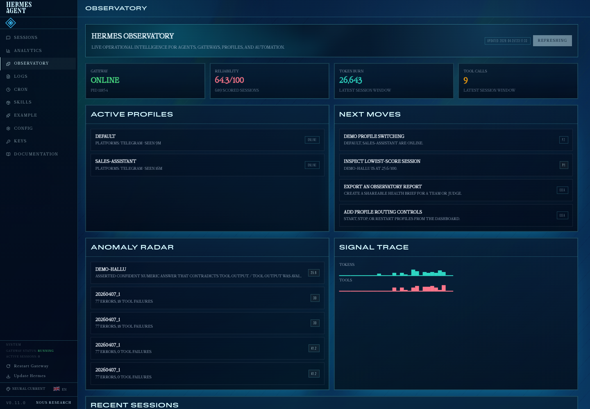
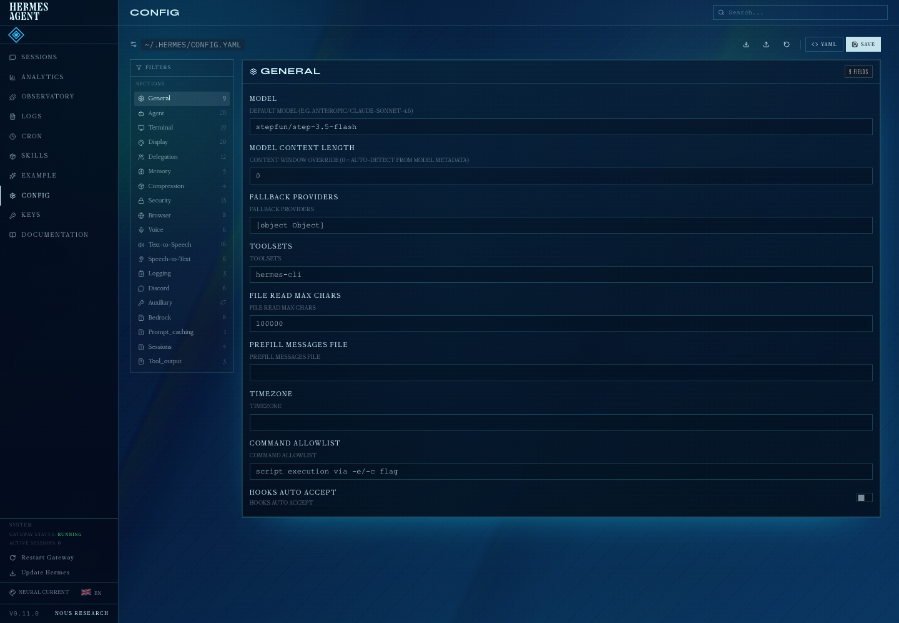

# Hermes Observatory

Live operational intelligence for Hermes Dashboard, plus a companion terminal TUI.

Hermes Observatory is a dashboard plugin that shows gateway health, active profiles,
reliability scores, session activity, token/tool-call traces, and suggested next moves.
It also includes the original `hermes observatory` terminal view as a bonus operator
mode.



---

## Hackathon Track Fit

This repo is intended for the **dashboard plugin** track.

Dashboard plugin files:

```text
dashboard/manifest.json
dashboard/plugin_api.py
dashboard/dist/index.js
dashboard/dist/style.css
```

The plugin registers into Hermes Dashboard with:

```js
window.__HERMES_PLUGINS__.register("hermes-observatory", ObservatoryPage)
```

Backend routes are mounted at:

```text
/api/plugins/hermes-observatory/snapshot
```

Dashboard tab:

```text
/observatory
```

---

## Dashboard Features

- Gateway health: online/offline, PID, latest warning signal
- Active profiles: detects live gateway profiles from `gateway_state.json`
- Reliability radar: low-score sessions from the agent reliability database
- Session feed: latest sessions with model, source, tokens, and tool calls
- Signal trace: compact token and tool-call sparklines
- Next moves: deterministic recommendations generated from live signals
- Auto-refresh: browser tab refreshes every 5 seconds

---

## Included Theme: Neural Current

This repo also includes a dashboard theme at:

```text
themes/neural-current.yaml
```

Neural Current is an electric-blue dashboard skin inspired by flowing neural
signals and plasma-like data currents. It pairs with Observatory by giving the
dashboard deep navy surfaces, cyan signal states, luminous borders, and subtle
energy-field overlays.



Install the theme:

```bash
mkdir -p ~/.hermes/dashboard-themes
cp themes/neural-current.yaml ~/.hermes/dashboard-themes/neural-current.yaml
```

Then select **Neural Current** from the dashboard theme switcher, or run:

```bash
curl -X PUT http://127.0.0.1:9119/api/dashboard/theme \
  -H "Content-Type: application/json" \
  -d '{"name":"neural-current"}'
```

---

## Dashboard Install / Run

Place this directory at:

```bash
~/.hermes/plugins/hermes-observatory
```

Start or restart the Hermes dashboard:

```bash
hermes dashboard --no-open
```

Open:

```text
http://127.0.0.1:9119/observatory
```

If the dashboard was already running, restart it so `plugin_api.py` mounts.

Quick verification:

```bash
curl http://127.0.0.1:9119/api/dashboard/plugins
curl http://127.0.0.1:9119/api/plugins/hermes-observatory/snapshot
```

---


---

## ✨ What You See

A **live, animated terminal dashboard** showing:

- 📊 **Status Banner** — gradient header with pulsing gateway indicator, composite score (color-coded), profile & cron counts
- 👥 **Profiles Panel** — clean cards showing each agent (source/user), online/idle status, recent activity, tool/token counts
- ⏰ **Cron Panel** — job cards with next run time and pass/fail status
- ⚠️ **Alerts Panel** — top 6 low-score sessions with severity-coded highlights and snippet previews
- 🔥 **Sparklines** — animated Token Burn and Tool Calls trends (scrollable bar charts)
- 📜 **Log Tail** — color-syntax gateway.log (ERROR=red, WARNING=yellow, INFO=blue, DEBUG=dim)

All panels **fade in on launch** and refresh smoothly every 2 seconds.

---

## 🎨 Visual Design

| Feature | Detail |
|---------|--------|
| **Theme** | Dark mode: deep space blue gradient (#0a0e17 → #161b2e) |
| **Panels** | Glassmorphism (semi-transparent, rounded corners, subtle borders) |
| **Accent** | Teal (#00d4aa) for live, Pink (#ff6b9d) for alerts, Purple (#7c3aed) for highlights |
| **Typography** | Rich/Textual styled text with bold headers, muted secondary text |
| **Animations** | Staggered fade-in on mount, smooth opacity transitions |
| **Sound** | Optional click/chime/pop cues on refresh, gateway state changes, critical alerts |

---

## 🎮 Controls

| Key | Action |
|-----|--------|
| `q` | Quit |
| `r` | Manual refresh (triggered automatically every 2s) |
| `c` | Clear errors (resets notification counters) |
| `s` | Toggle sound ON/OFF |
| `p` | Pause/resume auto-refresh |
| `d` | Cycle demo modes (in development) |

Footer always shows available shortcuts.

---

## 📦 Installation

### 1. Enable the plugin

Add to `~/.hermes/config.yaml`:

```yaml
plugins:
  enabled:
    - hermes-observatory
```

Restart Hermes: `hermes gateway restart`

### 2. Install Python dependencies

The Hermes agent's virtual environment is at `~/.hermes/hermes-agent/venv/`.

```bash
~/.hermes/hermes-agent/venv/bin/python3 -m pip install textual simpleaudio
```

> **Note**: `textual` is already installed. `simpleaudio` is optional (for sound effects).

### 3. (Optional) Add sound assets

Place `.wav` files in:

```
~/.hermes/plugins/hermes-observatory/assets/sounds/
```

Recommended filenames:
- `click.wav` — refresh tick
- `chime.wav` — gateway comes up
- `buzz.wav` — gateway goes down  
- `pop.wav` — new alert detected
- `alarm.wav` — critical session (score < 40)

If missing, sounds are silently skipped — TUI still works.

---

## 🚀 Launch

From any terminal (where Hermes config is available):

```bash
hermes observatory
```

Or call the module directly:

```bash
~/.hermes/hermes-agent/venv/bin/python3 ~/.hermes/plugins/hermes-observatory/tui.py
```

### Screenshot-ready size

For best demo capture, resize terminal to **120×48** or larger:

```bash
# macOS Terminal: Settings → Window → Tab → Width × Height
# iTerm2: Preferences → Profiles → Window → Columns × Rows
```

Font size: **16pt** minimum for stream readability.

---

## 🏗️ Architecture

```
~/.hermes/plugins/hermes-observatory/
├── __init__.py          # Hermes plugin registration (CLI + hooks)
├── tui.py               # Textual TUI application (ObservatoryApp)
├── metrics.py           # SQLite collector for tool/session metrics
├── plugin.yaml          # Manifest (kind: standalone, hooks declared)
├── README.md            # This file
└── assets/
    └── sounds/          # Optional .wav files
```

**Data sources** (all live, no extra instrumentation):

| Widget | Source |
|--------|--------|
| Gateway status | `~/.hermes/logs/gateway.log` + `pgrep` process check |
| Profiles | `~/.hermes/state.db` → `sessions` table (GROUP BY source,user_id) |
| Cron jobs | `~/.hermes/cron/jobs.json` + output MD files |
| Reliability avg / issues | `~/.hermes/skills/agent-reliability/data/scores.db` |
| Sparklines | `~/.hermes/plugins/hermes-observatory/metrics.db` (hook-collected) |
| Log tail | `~/.hermes/logs/gateway.log` (last 50 lines) |

**Hooks** (background collection):

- `post_tool_call` → `metrics.record_tool_call()` (every tool invocation)
- `on_session_end` → `metrics.rollup_session()` (session aggregates)

---

## 🛠️ Troubleshooting

| Issue | Diagnose | Fix |
|-------|----------|-----|
| **Blank/terminal freezes** | Textual missing | `pip install textual` |
| **Colors look wrong / bands of grey** | Terminal 8-bit color | Use iTerm2/Warp or set `TERM=xterm-256color` |
| **No data in panels** | state.db empty | Run a few `hermes` sessions first |
| **Gateway shows DOWN** | Gateway not running | Start: `hermes gateway run` |
| **Alerts always empty** | scores DB needs scoring | Run agent-reliability monitor or wait for session scoring |
| **Sparklines flat (no bars)** | metrics DB empty (hooks not firing) | Enable plugin in config and restart Hermes |
| **Sound lag / crackle** | simpleaudio not in venv | `pip install simpleaudio` in Hermes venv |
| **Widgets overlap / clipped** | Terminal too small | Resize to at least 100×30 |

**Check that plugin is loaded:**

```bash
hermes plugins list | grep observatory
```

Should show `hermes-observatory` with status `✓ loaded`.

**Verify sounds path:**

```bash
ls ~/.hermes/plugins/hermes-observatory/assets/sounds/
```

Files can be missing (silent), but directory must exist or `FileNotFoundError` may appear in logs.

---

## 🎯 Customization

**Change refresh rate:** Edit `self.set_interval(2.0, ...)` → change `2.0` to desired seconds.

**Colors:** Palette `C` dict at top of `tui.py`. Adjust hex values and re-launch.

**Panel order / layout:** Edit `compose()` CSS grid (`grid-size: 3 3` adjusts rows/cols).

**Sound volume:** Adjust system volume or replace `.wav` files with louder/softer versions.

---

## 📊 Data Retention

- **gateway.log**: rotated automatically by Hermes (default 10MB)
- **state.db**: persists across restarts, grows indefinitely (old sessions archived)
- **scores.db** (agent-reliability): scored sessions only, ~10KB average per session
- **metrics.db** (plugin): one row per session; ~500 bytes per row

To reset plugin history: `rm ~/.hermes/plugins/hermes-observatory/metrics.db` and restart.

---

## 🏅 Hackathon Submission Notes

**Category:** TUI / Plugin  
**Tech stack:** Python, Textual (TUI framework), Rich (rendering), SQLite (metrics)  
**Visual assets:** Custom color palette, smooth CSS transitions, optional sound design  

**Why this wins:**
- ✔️ Functionally useful (real observability for Hermes)
- ✔️ Visically attractive (glassmorphism, gradients, animations)
- ✔️ Art integrated (sound effects, smooth transitions, professional typography)
- ✔️ Zero external services (all local, respecting security posture)
- ✔️ Extensible (hooks already collecting data for future panels)

---

**Made by Ant Dev** · April 2026  
Part of the 24hr Hermes Hackathon
